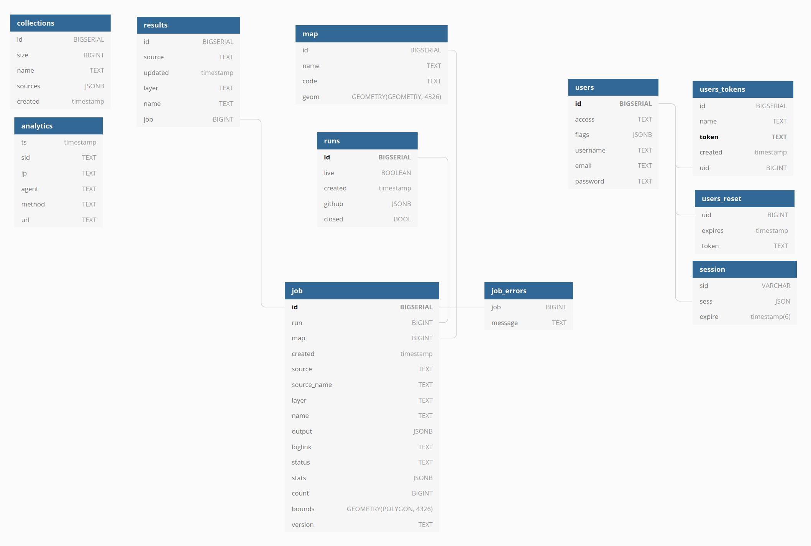

<h1 align=center>OpenAddresses Batch</h1>

## Deploy

Before you are able to deploy infrastructure you must first setup the [OpenAddresses Deploy tools](https://github.com/openaddresses/deploy)

Once these are installed, you can create the production stack via:
(Note: it should already exist!)

```sh
deploy create production
```

Or update to the latest GitSha or CloudFormation template via

```sh
deploy update production
```

### Parameters

Whenever you deploy, you will be prompted for the following parameters

#### GitSha

On every commit, GitHub actions will build the latest Docker image and push it to the `batch` ECR.
This parameter will be populated automatically by the `deploy` cli and simply points the stack
to use the correspondingly Docker image from ECR.

#### MapboxToken

A read-only Mapbox API token for displaying base maps underneath our address data. (Token should start with `pk.`)

#### Bucket

The bucket in which assets should be saved to. See the `S3 Assets` section of this document for more information

#### Branch

The branch with which weekly sources should be built from. When deployed into production this is generally `master`. When
testing new features this can be any `openaddresses/openaddresses` branch.

#### DatabaseType

The AWS RDS database class that powers the backend.

#### DatabasePassword

The password to set on the backend database. Passed to the API via docker env vars

#### SharedSecret

API functions that are public currently do not require any auth at all. Internal functions however are protected
by a stack-wide shared secret. This secret is an alpha-numeric string that is included in a `secret` header, to
authenticate internal API calls.

This value can be any secure alpha-numeric combination of characters and is safe to change at any time.

#### GithubSecret

This is the secret that Github uses to sign API events that are sent to this API. This shared signature allows
us to verify that events are from github. Only the production stack should use this parameter.

## Components

The project is divided into several componenets

| Component | Purpose |
| --------- | ------- |
| cloudformation | Deploy Configuration |
| api | Dockerized server for handling all API interactions |
| api/web | Subfolder for UI specific components |
| cli | CLI for manually queueing work to batch |
| lambda | Lambda responsible for instantiating a batch job environement and submitting it |
| task | Docker container for running a batch job |

## S3 Assets

By default, processed job assets are uploaded to the bucket `v2.openaddresses.io` in the following format

```
s3://v2.openaddresses.io/<stack>/job/<job_id>/source.png
s3://v2.openaddresses.io/<stack>/job/<job_id>/source.geojson
s3://v2.openaddresses.io/<stack>/job/<job_id>/cache.zip
```

Manual sources (sources that are cached to s3 via the upload tool), are in the following format
```
s3://v2.openaddresses.io/<stack>/upload/<user_id>/<file_name>
```

## API

API documentation is availiable [here](https://batch.openaddresses.io/docs/)

## Development

In order to set up an effective dev environment, first obtain a copy of the metastore.

Create a local

```sh
./clone prod
```

Then from the `/api` directory, run

```sh
npm run dev
```

Now, to build the latest UI, navigate to the `/api/web` directory in a seperate tab, and run:

```sh
npm run build --watch
```

Note: changes to the website will now to automatically rebuilt, just refresh the page to see them.

Finally, to access the api, navigate to `http://localhost:5000` in your web browser.

## Database

All data is persisted in an AWS RDS managed postgres database.


